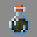

AntiPotions Mod Introduction
=======

<b>This mod provides a number of potions with special effects, these special effects. These special effects are used to counter some of the vanilla's annoying effects, or just have the opposite effects of the vanilla's potions.</b>

Potions Description
------

<table>
<tr><th>Icon</th><th>Name</th><th>Duration</th><th>Description</th></tr>
<tr>
<td rowspan="2"></td>
<td><b>Potion of Heaviness</b></td>
<td><b>3 : 00</b></td>
<td rowspan="2"><b>Gives immunity to levitation, but increase gravity.</b></td>
</tr>
<tr>
<td><b>Potion of Heaviness+</b></td>
<td><b>8 : 00</b></td>
</tr>
<tr>
<td rowspan="2"></td>
<td><b>Potion of Steadiness</b></td>
<td><b>3 : 00</b></td>
<td rowspan="2"><b>Upgrade version of heaviness, plus jump boost II.</b></td>
</tr>
<tr>
<td><b>Potion of Steadiness+</b></td>
<td><b>8 : 00</b></td>
</tr>
<tr>
<td rowspan="2"></td>
<td><b>Potion of Sight</b></td>
<td><b>3 : 00</b></td>
<td rowspan="2"><b>Upgrade version of night vision, plus darkness resistance and blindness resistance.</b></td>
</tr>
<tr>
<td><b>Potion of Sight+</b></td>
<td><b>8 : 00</b></td>
</tr>
<tr>
<td rowspan="2"></td>
<td><b>Potion of Visibility</b></td>
<td><b>3 : 00</b></td>
<td rowspan="2"><b>Inactivate invisibility and give glowing in duration time.</b></td>
</tr>
<tr>
<td><b>Potion of Visibility+</b></td>
<td><b>8 : 00</b></td>
</tr>
<tr>
<td rowspan="2"></td>
<td><b>Potion of Poison_Resistance</b></td>
<td><b>0 : 45</b></td>
<td rowspan="2"><b>Nullifies poison damage taken</b></td>
</tr>
<tr>
<td><b>Potion of Poison_Resistance+</b></td>
<td><b>1 : 30</b></td>
</tr>
<tr>
<td rowspan="2"></td>
<td><b>Potion of Wither_Resistance</b></td>
<td><b>3 : 00</b></td>
<td rowspan="2"><b>Nullifies wither damage taken</b></td>
</tr>
<tr>
<td><b>Potion of Wither_Resistance+</b></td>
<td><b>8 : 00</b></td>
</tr>
<tr>
<td rowspan="3"></td>
<td><b>Potion of Relish</b></td>
<td><b>3 : 00</b></td>
<td rowspan="3"><b>Speeds up eating, multiply the saturation and nutrition gained from foods by potion level.</b></td>
</tr>
<tr>
<td><b>Potion of Relish+</b></td>
<td><b>8 : 00</b></td>
</tr>
<tr>
<td><b>Potion of Relish II</b></td>
<td><b>1 : 30</b></td>
</tr>
<tr>
<td rowspan="3"></td>
<td><b>Potion of Sticky_Land</b></td>
<td><b>3 : 00</b></td>
<td rowspan="3"><b>Decreases jump height and reduces the height at which the fall is unharmed.</b></td>
</tr>
<tr>
<td><b>Potion of Sticky_Land+</b></td>
<td><b>8 : 00</b></td>
</tr>
<tr>
<td><b>Potion of Sticky_Land II</b></td>
<td><b>1 : 30</b></td>
</tr>
<tr>
<td rowspan="3"></td>
<td><b>Potion of the Thief</b></td>
<td><b>0 : 20</b></td>
<td rowspan="3"><b>Gives super speed and invisibility,but increases damage taken.</b></td>
</tr>
<tr>
<td><b>Potion of the Thief+</b></td>
<td><b>0 : 40</b></td>
</tr>
<tr>
<td><b>Potion of the Thief II</b></td>
<td><b>0 : 20</b></td>
</tr>
</table>

Potions Recipes
------

<table>
<tr>
<th><b>Result Potion</b></th><th><b>Input Potion</b></th><th><b>Ingredient</b></th><th><b>Icon</b></th>
</tr>
<tr>
<td><b>Potion of Heaviness</b></td>
<td><b>Awkward Potion</b></td>
<td><b>Popped Chorus Fruit</b></td>
<td></td>
</tr>
<tr>
<td rowspan="2"><b>Potion of Steadiness</b></td>
<td><b>Potion of Heaviness</b></td>
<td><b>Rabbit Foot</b></td>
<td></td>
</tr>
<tr>
<td><b>Potion of Leaping</b></td>
<td><b>Popped Chorus Fruit</b></td>
<td></td>
</tr>
<tr>
<td><b>Potion of Sight</b></td>
<td><b>Potion of Night Vision</b></td>
<td><b>Golden Carrot</b></td>
<td></td>
</tr>
<tr>
<td><b>Potion of Visibility</b></td>
<td><b>Potion of Night Vision</b></td>
<td><b>Ender Eye</b></td>
<td></td>
</tr>
<tr>
<td><b>Potion of Poison Resistance</b></td>
<td><b>Awkward Potion</b></td>
<td><b>Poisonous Potato</b></td>
<td></td>
</tr>
<tr>
<td><b>Potion of Wither Resistance</b></td>
<td><b>Awkward Potion</b></td>
<td><b>Wither Rose</b></td>
<td></td>
</tr>
<tr>
<td><b>Potion of Relish</b></td>
<td><b>Awkward Potion</b></td>
<td><b>Glow Berries</b></td>
<td></td>
</tr>
<tr>
<td><b>Potion of Sticky Land</b></td>
<td><b>Awkward Potion</b></td>
<td><b>Honeycomb</b></td>
<td></td>
</tr>
<tr>
<td><b>Potion of the Thief</b></td>
<td><b>Awkward Potion</b></td>
<td><b>Echo Shard</b></td>
<td></td>
</tr>
</table>

Suggestions and Issues
------

<b>Put a short and clear description in issues page please, with crash reports and screenshots if available</b>